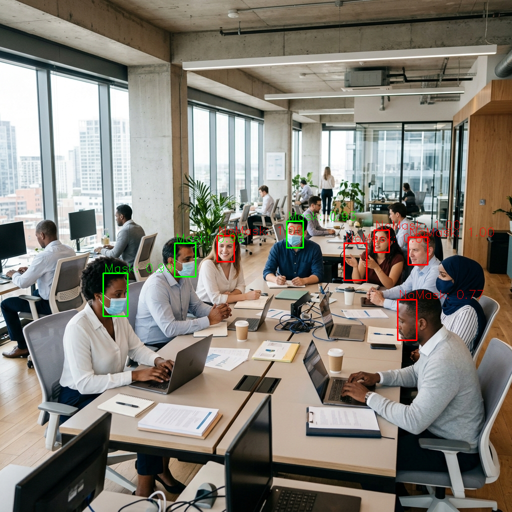

# Face Mask Detection

A real-time face mask detection system that supports all major deep learning frameworks.

- [x] PyTorch
- [x] TensorFlow (includes tflite and pb model)
- [x] Keras
- [x] MXNet
- [x] Caffe
- [x] Paddle
- [x] OpenCV DNN

---

**Detects faces and determines whether the person is wearing a mask.**

Face mask detection models and inference code are open-sourced across 5 mainstream deep learning frameworks (PyTorch, TensorFlow, Keras, MXNet, Caffe).

The training dataset contains 7971 annotated images composed of [WIDER Face](http://shuoyang1213.me/WIDERFACE/) and [MAFA](http://www.escience.cn/people/geshiming/mafa.html). You can download it from [Google Drive](https://drive.google.com/file/d/1QspxOJMDf_rAWVV7AU_Nc0rjo1_EPEDW/view?usp=sharing).



---

## Model Structure

The model uses an SSD-style architecture with a lightweight backbone to enable fast inference. Total parameters: **1.01M**.

- Input size: 260×260
- Backbone: 8 conv layers
- Total layers (including location and classification heads): 24

SSD anchor configuration:

| Multibox Layer | Feature Map Size | Anchor Size   | Aspect Ratio     |
|----------------|-----------------|---------------|------------------|
| First          | 33×33           | 0.04, 0.056   | 1, 0.62, 0.42    |
| Second         | 17×17           | 0.08, 0.11    | 1, 0.62, 0.42    |
| Third          | 9×9             | 0.16, 0.22    | 1, 0.62, 0.42    |
| Fourth         | 5×5             | 0.32, 0.45    | 1, 0.62, 0.42    |
| Fifth          | 3×3             | 0.64, 0.72    | 1, 0.62, 0.42    |

---

## Setup

```bash
# Create and activate a Python 3.9 virtual environment
python3 -m venv venv
source venv/bin/activate

# Install all dependencies
pip install -r requirements.txt
```

---

## How to Run

### Activate the virtual environment first
```bash
source venv/bin/activate
```

### OpenCV DNN (Caffe model)
```bash
# On image
python opencv_dnn_infer.py --img-mode 1 --img-path img/demo2.jpg
```

### Paddle
```bash
# On image
python paddle_infer.py --img-path img/demo2.jpg
```

### PyTorch
```bash
# On image
python pytorch_infer.py --img-mode 1 --img-path img/demo2.jpg

# On video
python pytorch_infer.py --img-mode 0 --video-path /path/to/video

# Using webcam
python pytorch_infer.py --img-mode 0 --video-path 0
```

### TensorFlow
```bash
python tensorflow_infer.py --img-mode 1 --img-path img/demo2.jpg
```

### Keras
```bash
python keras_infer.py --img-mode 1 --img-path img/demo2.jpg
```

> **Note:** For Caffe inference, the model uses a permute layer which requires [caffe-ssd](https://github.com/weiliu89/caffe/tree/ssd). Alternatively, use `opencv_dnn_infer.py` which supports the permute layer natively.

---

## Appendix

### Model Architecture

BN layers are merged into Conv layers to accelerate inference speed.


### Precision-Recall Curve


